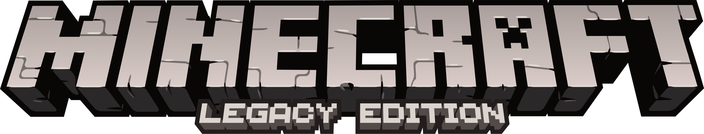

<div align="center">



<br/>

### Source code for [minecraftlegacy.com](https://minecraftlegacy.com)

[](https://minecraftlegacy.com)
[](https://discord.gg/MinecraftLegacy)

---

</div>

The Legacy Repository Index - a searchable, paginated directory of archived Minecraft source code, tools, launchers, and community projects. Built with React + Vite, powered by data from the [json](https://github.com/MinecraftConsole/json) repo.

## Setup

```
npm install
npm run dev
```

Runs on `localhost:5173`. Uses `placeholder.json` on localhost and `projects.json` in production.

## Build

```
npm run build
```

Output goes to `dist/`.

## Deploy

Deployed to Cloudflare Pages.

```
npm run build
```

Push the built `dist/` output to your Cloudflare Pages project.

## Stack

- React 18
- Vite 5
- Minecraft font (`typeface-minecraft`)
- Cloudflare Pages

## Contributing

1. Fork this repo
2. Create a branch (`git checkout -b feature/thing`)
3. Commit your changes
4. Open a PR

For adding projects to the index, use the [json repo](https://github.com/MinecraftConsole/json) instead.

## License

[MIT](LICENSE)

<div align="center">
<sub>Not affiliated with Mojang AB or Microsoft. "Minecraft" is a trademark of Mojang Synergies AB.</sub>
</div>
